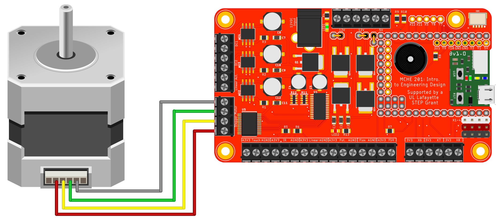

Date: 11/01/19    
Team Lead: Joshua Vaughan - joshua.vaughan@louisiana.edu    
Members:
* Gerald Eaglin - gge0866@louisiana.edu
* Ben Armentor - benjamin.armentor1@louisiana.edu
* Dallas Mitchell - dallas.mitchell1@louisiana.edu

# Project 1 Descriptive Name
Sub-project Lead: Name 1 - undergraduate_researcher@louisiana.edu    
Additional Members:
* Name 2 - undergraduate_researcher2@louisiana.edu
* Name 3 - undergraduate_researcher3@louisiana.edu

## Long-term Project Goal
...

## Short-term Goal
...

## Recent Results Overview
Lorem ipsum dolor sit amet, consectetur adipisicing elit, sed do eiusmod tempor incididunt ut labore et dolore magna aliqua. Ut enim ad minim veniam, quis nostrud exercitation ullamco laboris nisi ut aliquip ex ea commodo consequat. Duis aute irure dolor in reprehenderit in voluptate velit esse cillum dolore eu fugiat nulla pariatur. Excepteur sint occaecat cupidatat non proident, sunt in culpa qui officia deserunt mollit anim id est laborum. The Markdown below shows linking to an image that is at a generic web address

 **Figure 1: A Mass-spring-damper System**

Sed ut perspiciatis unde omnis iste natus error sit voluptatem accusantium doloremque laudantium, totam rem aperiam, eaque ipsa quae ab illo inventore veritatis et quasi architecto beatae vitae dicta sunt explicabo. Nemo enim ipsam voluptatem quia voluptas sit aspernatur aut odit aut fugit, sed quia consequuntur magni dolores eos qui ratione voluptatem sequi nesciunt. 

The Markdown below shows how to link to a figure in a repository sub-folder. In this case, it's named `figures`.

 **Figure 2: MCHE201 Breakout Board Stepper Motor Configuration**

Neque porro quisquam est, qui dolorem ipsum quia dolor sit amet, consectetur, adipisci velit, sed quia non numquam eius modi tempora incidunt ut labore et dolore magnam aliquam quaerat voluptatem. Ut enim ad minima veniam, quis nostrum exercitationem ullam corporis suscipit laboriosam, nisi ut aliquid ex ea commodi consequatur? 

You can also manage the figure size by writing the `html` directly. This is shown in the snippet below.

     
    <strong>Figure 3: MCHE201 Breakout Inserted with Pure HTML</strong>

## Plan for the next two weeks
### What are your next steps?
### What work do you expect to have done by next report? What results to you expect?
### Are we on schedule with respect to the GitHub Project and/or Gantt Chart?

# Project 2 Descriptive Name
Sub-project Lead: undergraduate_researcher@louisiana.edu

## Long-term Project Goal
...

## Short-term Goal
...

## Recent Results Overview
Lorem ipsum dolor sit amet, consectetur adipisicing elit, sed do eiusmod tempor incididunt ut labore et dolore magna aliqua. Ut enim ad minim veniam, quis nostrud exercitation ullamco laboris nisi ut aliquip ex ea commodo consequat. Duis aute irure dolor in reprehenderit in voluptate velit esse cillum dolore eu fugiat nulla pariatur. Excepteur sint occaecat cupidatat non proident, sunt in culpa qui officia deserunt mollit anim id est laborum.

Sed ut perspiciatis unde omnis iste natus error sit voluptatem accusantium doloremque laudantium, totam rem aperiam, eaque ipsa quae ab illo inventore veritatis et quasi architecto beatae vitae dicta sunt explicabo. Nemo enim ipsam voluptatem quia voluptas sit aspernatur aut odit aut fugit, sed quia consequuntur magni dolores eos qui ratione voluptatem sequi nesciunt. Neque porro quisquam est, qui dolorem ipsum quia dolor sit amet, consectetur, adipisci velit, sed quia non numquam eius modi tempora incidunt ut labore et dolore magnam aliquam quaerat voluptatem. Ut enim ad minima veniam, quis nostrum exercitationem ullam corporis suscipit laboriosam, nisi ut aliquid ex ea commodi consequatur? Quis autem vel eum iure reprehenderit qui in ea voluptate velit esse quam nihil molestiae consequatur, vel illum qui dolorem eum fugiat quo voluptas nulla pariatur?

## Plan for the next two weeks
### What are your next steps?
### What work do you expect to have done by next report? What results to you expect?
### Are we on schedule with respect to the GitHub Project and/or Gantt Chart?

# Project 3 Descriptive Name
Sub-project Lead: undergraduate_researcher@louisiana.edu

## Long-term Project Goal
...

## Short-term Goal
...

## Recent Results Overview
Lorem ipsum dolor sit amet, consectetur adipisicing elit, sed do eiusmod tempor incididunt ut labore et dolore magna aliqua. Ut enim ad minim veniam, quis nostrud exercitation ullamco laboris nisi ut aliquip ex ea commodo consequat. Duis aute irure dolor in reprehenderit in voluptate velit esse cillum dolore eu fugiat nulla pariatur. Excepteur sint occaecat cupidatat non proident, sunt in culpa qui officia deserunt mollit anim id est laborum.

Sed ut perspiciatis unde omnis iste natus error sit voluptatem accusantium doloremque laudantium, totam rem aperiam, eaque ipsa quae ab illo inventore veritatis et quasi architecto beatae vitae dicta sunt explicabo. Nemo enim ipsam voluptatem quia voluptas sit aspernatur aut odit aut fugit, sed quia consequuntur magni dolores eos qui ratione voluptatem sequi nesciunt. Neque porro quisquam est, qui dolorem ipsum quia dolor sit amet, consectetur, adipisci velit, sed quia non numquam eius modi tempora incidunt ut labore et dolore magnam aliquam quaerat voluptatem. Ut enim ad minima veniam, quis nostrum exercitationem ullam corporis suscipit laboriosam, nisi ut aliquid ex ea commodi consequatur? Quis autem vel eum iure reprehenderit qui in ea voluptate velit esse quam nihil molestiae consequatur, vel illum qui dolorem eum fugiat quo voluptas nulla pariatur?

## Plan for the next two weeks
### What are your next steps?
### What work do you expect to have done by next report? What results to you expect?
### Are we on schedule with respect to the GitHub Project and/or Gantt Chart?

# Long-term planning
## Upcoming Paper Deadlines

## Administrative Deadlines
